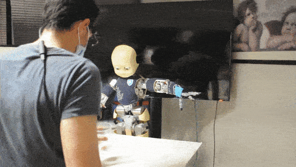

# Gaze Dialogue Model

[](https://app.travis-ci.com/NunoDuarte/GazeDialogue)
[](https://github.com/Naereen/StrapDown.js/blob/master/LICENSE)

The Gaze Dialogue Model is a system for the iCub Humanoid Robot that enables more natural human-robot interaction through gaze.

<p align="center">
  
  
</p>

## Table of Contents

* [Features](#features)
* [Demos](#demos)
* [Tested on](#tested-on)
* [Dependencies](#dependencies)
* [Installation](#installation)
* [Usage](#usage)
* [Troubleshooting](#troubleshooting)
* [Structure](#structure)
* [Citation](#citation)

## Features

*   **Gaze-based interaction:** Control the iCub robot's actions using your gaze.
*   **Object and face detection:** The system can identify objects and faces in the environment.
*   **Robot as leader or follower:** The iCub can either lead the interaction or follow the user's gaze.
*   **Real-time performance:** The system is designed to run in real-time with minimal latency.
*   **Support for iCub and iCubSim:** The system can be used with both the real iCub robot and the iCub simulator.

## Demos

**iCub Leader** &nbsp;&nbsp;&nbsp;&nbsp;&nbsp;&nbsp;&nbsp;&nbsp;&nbsp;&nbsp;&nbsp;&nbsp;&nbsp;&nbsp;&nbsp;&nbsp;&nbsp;&nbsp;&nbsp;&nbsp;&nbsp;&nbsp;&nbsp;&nbsp;&nbsp;&nbsp;&nbsp;&nbsp;&nbsp;&nbsp;&nbsp;&nbsp;&nbsp;&nbsp;&nbsp;&nbsp;&nbsp;&nbsp;&nbsp;&nbsp;&nbsp;&nbsp;&nbsp;&nbsp;&nbsp;&nbsp;&nbsp;&nbsp;&nbsp;&nbsp;&nbsp;&nbsp;&nbsp;&nbsp;&nbsp;&nbsp;&nbsp;&nbsp;&nbsp;&nbsp;&nbsp;&nbsp;&nbsp;&nbsp;&nbsp;&nbsp;&nbsp;&nbsp;&nbsp;&nbsp; **iCub Follower** <br>
 


## Tested on


## Dependencies

### Controller App

*   **YCM:**
    ```bash
    git clone https://github.com/robotology/ycm.git -b v0.11.3
    ```
*   **YARP:**
    *   Ubuntu 16.04:
        ```bash
        git clone https://github.com/robotology/yarp.git -b v2.3.72
        ```
    *   Ubuntu 20.04:
        ```bash
        git clone https://github.com/robotology/yarp.git -b v3.4.0
        ```
*   **icub-main:**
    *   Ubuntu 16.04:
        ```bash
        git clone https://github.com/robotology/icub-main.git -b v1.10.0
        ```
    *   Ubuntu 20.04:
        ```bash
        git clone https://github.com/robotology/icub-main.git -b v1.17.0
        ```
*   **icub-contrib-common:** (Ubuntu 16.04 only)
    ```bash
    git clone https://github.com/robotology/icub-contrib-common -b 7d9b7e4
    ```
*   **OpenCV:** (Optional, tested on v3.4.1 and v3.4.17) Recommended with CUDA.

### Detection App

*   **Python:** 3.5.5 or 3.9
*   **Tensorflow:** 1.9 or 2.15.0
*   **Anaconda:** Recommended for managing virtual environments.
*   **Requirements:**
    ```bash
    pip3 install -r requirements.txt
    ```
*   **Tensorflow Models:**
    ```bash
    git clone https://github.com/tensorflow/models.git
    ```
*   **pylsl:** Requires liblsl (v1.13.0)

### Connectivity App

*   **YARP**
*   **PupilLabs Capture:** or install from source.
*   **PupilLabs LSL plugin**
*   **ROS:** (Alternative to LSL, not yet tested)
*   **PupilLabs ROS plugin**

## Installation

1.  **Clone the repository:**
    ```bash
    git clone git@github.com:NunoDuarte/GazeDialogue.git
    ```
2.  **Install dependencies:** Install the dependencies for the [controller](#controller-app), [detection](#detection-app), and [connectivity](#connectivity-app) apps.
3.  **Build the controller app:**
    ```bash
    cd controller
    mkdir build
    ccmake .
    make -j
    ```
4.  **Set up the detection app:**
    *   Add the Tensorflow Object Detection API to your `PYTHONPATH`:
        ```bash
        cd models/research
        export PYTHONPATH=$PYTHONPATH:$(pwd)/slim
        export PYTHONPATH=$PYTHONPATH:$(pwd):$(pwd)/object_detection
        ```
    *   Set the `PYLSL_LIB` environment variable to the path of your `liblsl.so` file.

## Usage

### Testing the Detection App

1.  Navigate to the `detection` directory:
    ```bash
    cd detection
    ```
2.  Run the offline detection script:
    ```bash
    python3 main_offline.py
    ```
    This will run the detection system on pre-recorded data and output the detected gaze fixations.

### Running the System with iCubSim

#### Manual Mode

1.  Start `yarpserver` and `yarpmanager`.
2.  In `yarpmanager`, open and run the applications in `controller/apps/iCub_startup.xml` and `controller/apps/GazeDialogue_leader.xml`.
3.  Run the detector and manual leader executables:
    ```bash
    ./gazePupil-detector
    ./gazePupil-manual-leader
    ```
4.  Connect the YARP ports.
5.  Use the `yarp rpc /service` to send commands to the robot.

#### GazeDialogue Mode

1.  Follow steps 1 and 2 from the manual mode.
2.  Run the detector:
    ```bash
    ./gazePupil-detector
    ```
3.  Turn on PupilLabs Capture and the LSL streaming plugin.
4.  Run the detection script:
    ```bash
    python3 main.py
    ```
5.  Run the Pupil\_Stream\_to\_Yarp executable.
6.  Run the main process for either the leader or follower:
    *   **Leader:**
        ```bash
        ./gazePupil-main-leader
        ```
    *   **Follower:**
        ```bash
        ./gazePupil-main-follower
        ```
7.  Connect the YARP ports.

### Running the System with the Real iCub

1.  Change the robot name in `src/extras/configure.cpp` from `icubSim` to `icub`.
2.  Recompile the controller app.
3.  Follow the instructions for the GazeDialogue mode, but with the real robot.

## Troubleshooting

### Connectivity Issues

*   **LSL Pupil - YARP on Ubuntu 16.04:**
    *   Install CodeBlocks, PyCharm, YARP 2.3.72, Pupil 1.7.42, and the LSL Relay and Pupil Remote plugins.
    *   Configure the build options in CodeBlocks to correctly link the YARP, LSL, and JSON libraries.
*   **`pthread_create@2.2.5` error in CodeBlocks:** Add `-pthread` to the compiler and linker settings.
*   **`libYARP_init.so.3` not found:** Add the path to the YARP libraries to the linker search directories.
*   **Shared library not found (e.g., `liblsl64.so.1.2.0`):** Add the directory containing the library to the linker search directories.

### Tensorflow and CUDA Issues

*   **Ubuntu 16.04 with CUDA 11.2 and Tensorflow 2.7:**
    *   Install NVIDIA driver 460.32.03 and CUDA 11.2.
    *   Install cuDNN 8.1 for CUDA 11.0, 11.1, and 11.2.
    *   Set the `PATH` and `LD_LIBRARY_PATH` environment variables to include the CUDA directories.
*   **`tf.gfile.GFile` error in Tensorflow 2.7:** Change `tf.gfile.GFile` to `tf.io.gfile.GFile` in `label_map_utils.py`.

### Dual-Computer System

*   If you are running the detection and/or connectivity apps on a different computer from the iCub, make sure to configure YARP to connect to the correct IP address.

## Structure

```
.
├─── Controller
│   ├── CMakeLists.txt
│   ├── app
│   └── src
├─── Detection
│   ├── main.py
│   └── ...
└─── connectivity
    └── ...
```

## Citation

If you find this code useful in your research, please consider citing our [paper](https://ieeexplore.ieee.org/abstract/document/9965577):

    M. Raković, N. F. Duarte, J. Marques, A. Billard and J. Santos-Victor, "The Gaze Dialogue Model: Nonverbal Communication in HHI and HRI," in IEEE Transactions on Cybernetics, doi: 10.1109/TCYB.2022.3222077.
